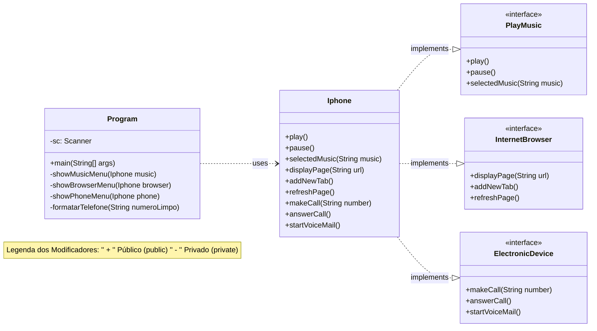

```mermaid
classDiagram
    direction LR

    class PlayMusic {
        +play()
        +pause()
        +selectedMusic(String music)
    }
    <<interface>> PlayMusic

    class InternetBrowser {
        +displayPage(String url)
        +addNewTab()
        +refreshPage()
    }
    <<interface>> InternetBrowser

    class ElectronicDevice {
        +makeCall(String number)
        +answerCall()
        +startVoiceMail()
    }
    <<interface>> ElectronicDevice
    
    class Iphone {
       +play()
       +pause()
       +selectedMusic(String music)
       +displayPage(String url)
       +addNewTab()
       +refreshPage()
       +makeCall(String number)
       +answerCall()
       +startVoiceMail()
    }

    class Program {
       -sc: Scanner
       +main(String[] args)
       -showMusicMenu(Iphone music)
       -showBrowserMenu(Iphone browser)
       -showPhoneMenu(Iphone phone)
       -formatarTelefone(String numeroLimpo)
    }

    note "Legenda dos Modificadores:  '' + '' Público (public)  '' - '' Privado (private)"

    Iphone ..|> PlayMusic : implements
    Iphone ..|> InternetBrowser : implements
    Iphone ..|> ElectronicDevice : implements

    Program ..> Iphone : uses
``` 