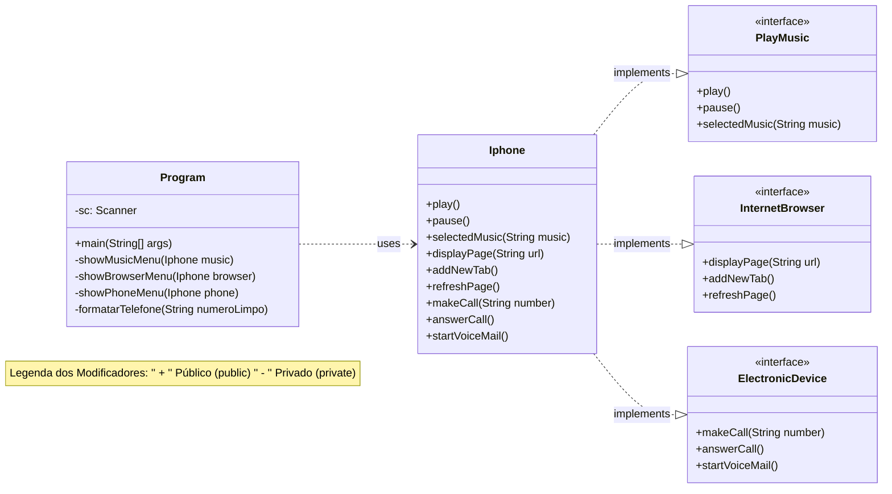

# Desafio POO

## Contexto
O desafio POO, com uso da linguagem de programação Java, usaremos como base o componente iPhone 2007, abrangendo suas funcionalidades como Reprodutor Musical, Aparelho Telefônico e Navegador na Internet.

#### Resumo do Desafio

O objetivo é modelar um **Iphone** que possui múltiplas funcionalidades distintas: tocar música, funcionar como um aparelho eletrônico e navegar na internet. Em vez de colocar toda a lógica diretamente na classe Iphone, nós separamos cada responsabilidade em um **"contrato"** diferente, chamado de **interface**. Quais são apresentados abaixo:

*  **PlayMusic**
   -- Métodos: `play()`, `pause()`, `selectedMusic(String musica)`
*  **ElectronicDevice**
   -- Métodos: `makeCall(String number)`, `answerCall()`, `startVoiceMail()`
*  **InternetBrowser**
   -- Métodos: `displayPage(String url)`, `addNewTab()`, `refreshPage()`

A classe Iphone então **"assina"** esses três contratos, prometendo implementar todas as funcionalidades exigidas. Finalmente, uma outra classe, **Program**, usa o **Iphone** e possui suas próprias regras internas **(métodos privados)** para gerenciar o fluxo de execução. O diagrama **UML** abaixo demonstra mais detalhe do que se foi feito.  

   

### Diagrama UML (Mermaid)

## Execução do código

. Execute o código e siga o exemplo abaixo

* Terminal: 

        ("=========Iphone==========")
        ("1 - Reprodutor de Música ")
        ("2 - Navegador de Internet" )
        ("3 - Aparelho telefônico ")
        ("=======================") 
 
* Usúario: *"Escolha umas das três opções"*

**Observação**: Depois de realizar a escolha irá aparecer funções da opção desejada e repita o processo e siga as intruções do código.